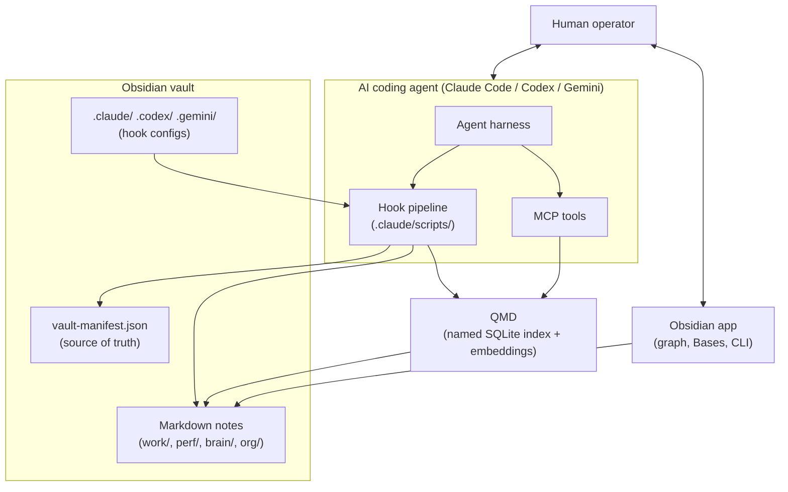
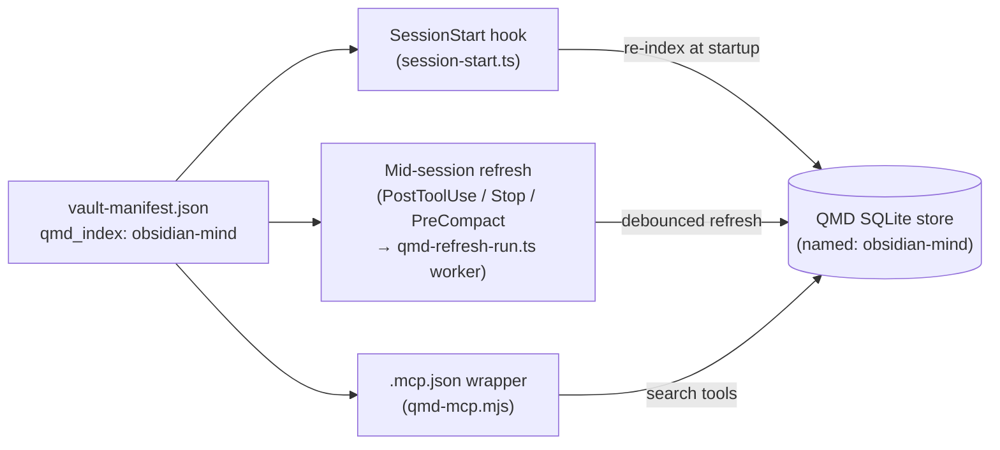
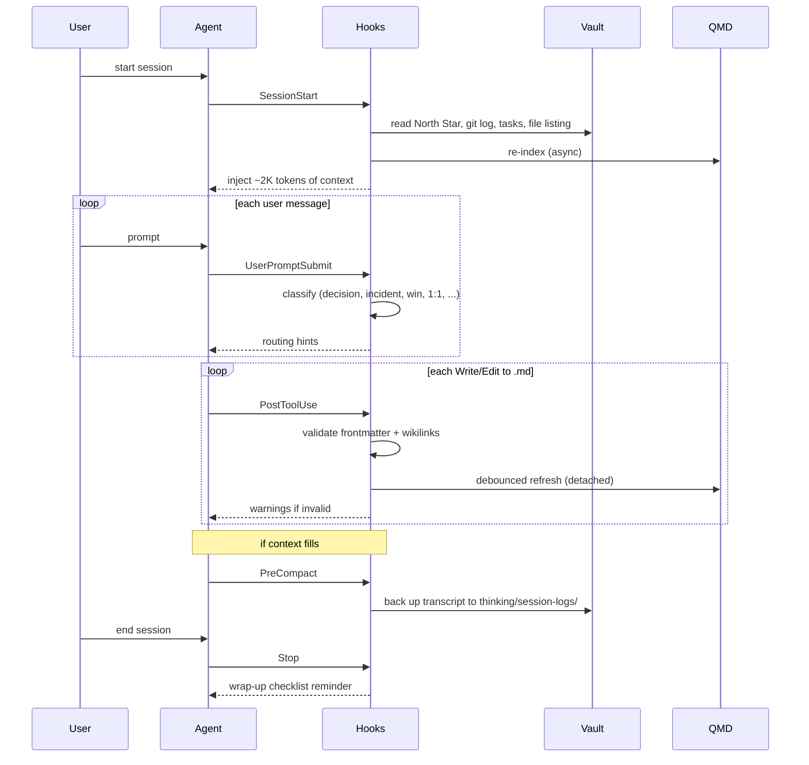
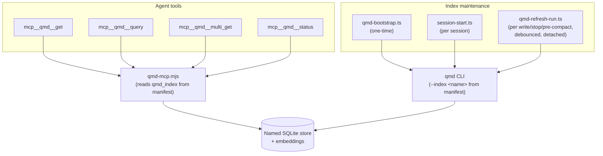
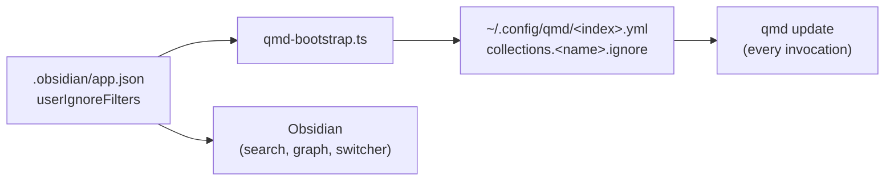
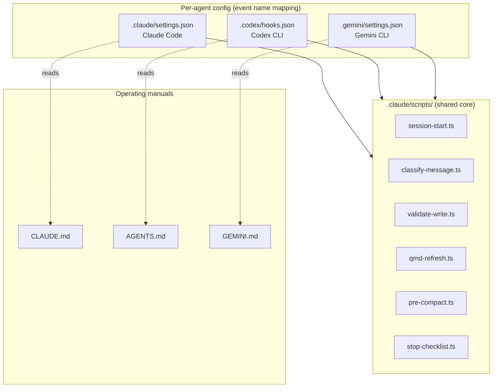
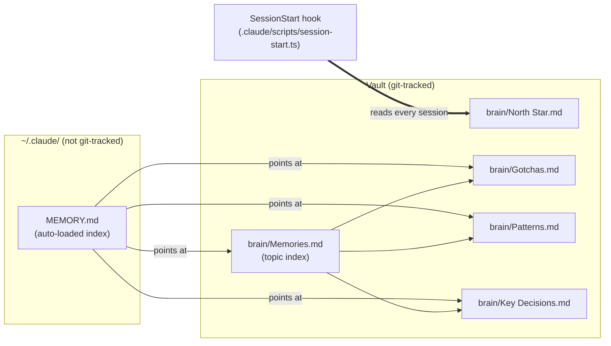

# Architecture

This document describes how obsidian-mind fits together — the load-bearing seams, the design choices behind them, and where to extend the system. It is aimed at contributors and anyone forking the template who wants to customize it without breaking the mechanics.

It is not a folder tour. For the day-to-day layout, read `CLAUDE.md`. For the user-facing story, read `README.md`.

---

## System Overview

obsidian-mind is a plain Obsidian vault with three systems layered on top:

1. **The vault itself** — Markdown files, frontmatter, wikilinks. Portable, git-tracked, Obsidian-browsable.
2. **A hook pipeline** — small TypeScript scripts invoked by the agent harness at lifecycle events (session start, every message, after writes, before compaction, at session end).
3. **A semantic search layer (QMD)** — a separate CLI + SQLite index + MCP server, all scoped to a named index read from `vault-manifest.json`.

The three layers communicate through one coordination point: **`vault-manifest.json`**. It declares the template version, the QMD index name, and the boundary between infrastructure files (shipped by the template) and user content (created by the human).

The vault is the persistent state. Everything else is machinery around it.

---

## Division of Responsibility

Two actors do the work, and the boundary between them is the most important design choice in the system.

**Procedural code owns the environment.** Hooks in `.claude/scripts/` classify messages, validate writes, maintain the QMD index, inject context at session start, and back up transcripts before compaction. None of this logic is in the agent's head. It runs identically whether the agent is Claude Code, Codex, or Gemini, and it produces deterministic, testable behavior — the hook test suite has 400+ unit tests locking the contracts.

**The agent owns content.** Writing notes, choosing where to file them, adding wikilinks, updating indexes, promoting thinking drafts, drafting review briefs — these are judgments, not rules, and they live with the agent. `CLAUDE.md` documents the conventions the agent should follow; it does not replace the agent's judgment.

The two halves meet at small, well-defined handoffs: hooks inject context and routing hints through stdout, the agent reads the vault and calls Write or Edit. Neither side reaches across the boundary. This is what keeps the hooks portable (no agent-specific logic) and keeps the agent's tokens pointed at judgment rather than bookkeeping.

---

## Design Principles

Four ideas shape every decision in this template. When a change breaks one of them, it needs a very good reason.

### 1. Graph-first, not folder-first

Folders group by purpose. Links group by meaning. A note lives in one folder (its home) but links to many notes (its context). Competency notes stay definitional and receive evidence through backlinks — review prep becomes reading the backlinks panel on each competency. This is why every new note must link to at least one existing note, and why the agent is instructed to treat orphan notes as bugs.

### 2. Vault-first memory

All durable knowledge lives in the vault, inside `brain/` topic notes. The agent-specific memory indexes (`~/.claude/.../MEMORY.md`) are pointers to vault locations, never the storage themselves. This keeps memory git-tracked, machine-portable, and visible in the Obsidian graph.

### 3. Progressive disclosure

`SessionStart` injects ~2K tokens of lightweight context (North Star excerpt, git summary, tasks, file listing). Full note contents are pulled on demand via QMD semantic search. A full file read is a last resort, not a default. This keeps session cost flat regardless of vault size.

### 4. Agent-agnostic core

The hook scripts, subagent prompts, command definitions, and vault conventions are pure Markdown and TypeScript with no SDK dependencies. Each agent (Claude Code, Codex CLI, Gemini CLI) brings its own config file pointing at the same scripts. Only the `~/.claude/` auto-memory loader is Claude Code-specific.

---

## The Manifest as Source of Truth

`vault-manifest.json` is the one file that every layer reads. It answers five questions:

| Question | Field |
|----------|-------|
| What version of the template is this? | `version`, `released`, `version_fingerprints` |
| What does QMD call its store? | `qmd_index`, `qmd_context` |
| Which files are template infrastructure? | `infrastructure[]` |
| Which files are user content? | `user_content_roots[]`, `scaffold{}` |
| What frontmatter is required for each note type? | `frontmatter_required{}` |

The `qmd_index` field is the most load-bearing. Three independent callers read it:

Because all three callers derive the index name from the same field, the vault can coexist with other QMD-indexed projects on the same machine without collision. Change `qmd_index` in the manifest and the next bootstrap creates a fresh, isolated store.

The `infrastructure[]` vs `user_content_roots[]` split is what makes `/om-vault-upgrade` work. When importing from an older template, the migrator overwrites infrastructure files wholesale and preserves user content untouched.

---

## Lifecycle Hooks

Five hooks run at different moments in a session. Each is a small Node script invoked via `--experimental-strip-types` (TypeScript executes directly, no build step).

A few specific design choices are worth calling out:

- **`SessionStart` injects, it does not load.** It builds a ~2K-token briefing (filename listing, North Star excerpt, git summary, open tasks) and hands it to the agent. Full note contents never flow through this hook.
- **`UserPromptSubmit` classifies, it does not route.** It tags the prompt with hints like `ARCHITECTURE discussion` or `DECISION`; the agent decides where to file. Keeping the hook opinion-free means the routing logic lives in `CLAUDE.md`, which is editable per-user without touching scripts.
- **QMD refresh is shared, debounced, and detached.** Three hook entries fire the same refresh helper — `PostToolUse` (after `.md` writes), `PreCompact` (before transcript backup; writes tend to cluster before compaction), and `Stop` (end of session) — sharing one sentinel file so a burst of events produces at most one worker per debounce window. The actual indexing runs in `.claude/scripts/qmd-refresh-run.ts` as a detached, stdio-silent worker (`qmd update` → `qmd embed` → tail-chase `qmd update`), so the parent hook returns in milliseconds and nothing flows to the agent's context.
- **`PreCompact` also backs up the transcript.** In addition to kicking the QMD refresh, it copies the current session transcript out to `thinking/session-logs/` so long conversations remain recoverable after compaction.
- **`Stop` is deliberately lightweight.** Beyond triggering the shared refresh, it only prints a short checklist. For a thorough review, the user invokes `/om-wrap-up` explicitly. Putting heavy logic in a Stop hook would slow every session exit and surprise the user.

---

## QMD Integration

QMD provides semantic search. It is the mechanism behind most of the agent's retrieval intelligence. Three entry points all read from the same named index:

| Caller | Entry point | When |
|--------|-------------|------|
| Agent tool menu | `.mcp.json` → `qmd-mcp.mjs` | Every `mcp__qmd__*` tool call from the agent |
| Session startup | `session-start.ts` | Re-index on every new session |
| Mid-session refresh | `qmd-refresh.ts` / `stop-checklist.ts` / `pre-compact.ts` → shared debounce → `qmd-refresh-run.ts` | After `.md` writes, at session end, and before compaction |

Every `qmd update` invocation re-reads the per-index YAML (`~/.config/qmd/<index>.yml`), so changes to the collection config — including the ignore list synced from `.obsidian/app.json` — propagate to every surface without a session restart.

QMD is technically optional. When it isn't installed at all, the agent falls back through a preference order defined in `CLAUDE.md` and the qmd skill: MCP tools first when registered, then the `qmd` CLI, then Grep/Glob/Read as a last resort. Every fallback step is non-fatal: `.mcp.json` entries that fail to launch are skipped with a harmless warning, the hook scripts detect a missing `qmd` binary and no-op, and the operating manual tells the agent what to reach for next.

### MCP as the agent-facing contract

When the MCP server is registered, the agent's normal path to QMD is through typed tools — `mcp__qmd__query`, `mcp__qmd__get`, `mcp__qmd__multi_get`, and `mcp__qmd__status` — that appear in its tool menu alongside Read and Edit. These come from the [Model Context Protocol](https://modelcontextprotocol.io) server declared in `.mcp.json`, launched by a thin wrapper (`.claude/scripts/qmd-mcp.mjs`) that reads `qmd_index` from the manifest and invokes `qmd mcp` underneath. The CLI remains available — and is documented as the fallback — but during a session with MCP live, the agent goes through typed tools, not shell.

The wrapper exists so that each vault can run its own isolated index without users hand-editing `.mcp.json`. The index name flows from the manifest into the wrapper, the wrapper into QMD, QMD into its per-vault SQLite store.

The contract matters because the alternative — teaching every subagent and slash command to shell out to `qmd search` on every call — would couple each prompt to QMD's CLI surface, duplicate parse/retry logic across files, and force every prompt to re-explain the tool. MCP collapses all of that into one typed interface for the in-session path. When QMD changes its CLI, the wrapper adapts; the rest of the template is insulated. When another MCP-aware service needs to join the vault (a bug tracker, a docs search, a calendar), it registers in `.mcp.json` and gains the same privileged position.

### One ignore list, two engines

Obsidian and QMD both need to know which files to hide from search. Rather than maintain two lists that can drift, the template treats `.obsidian/app.json` → `userIgnoreFilters` as the single source of truth. `qmd-bootstrap.ts` reads that array and writes it into the QMD per-index YAML (`~/.config/qmd/<index>.yml`) as the collection's `ignore` field. Every subsequent `qmd update` (initial index, mid-session refresh, session-start reindex) honors the list.

This is why the list lives in Obsidian's config and not `vault-manifest.json`: users who adjust what's hidden in Obsidian's UI get the same change propagated to QMD on the next bootstrap. Files that are infrastructure (template dev docs like this one, `CHANGELOG.md`, `CONTRIBUTING.md`) are good candidates; user-authored content should not be here.

---

## Multi-Agent Portability

The same scripts serve three agents. Each agent has its own config file mapping its own event names to the shared scripts. The event vocabularies differ — Claude Code calls it `Stop`, Gemini calls it `SessionEnd`, Codex has no compaction event — but the scripts are identical.

Commands in `.claude/commands/` are plain Markdown prompts. Claude Code invokes them as slash commands. Codex and Gemini treat them as regular prompts (users type `om-standup` without the leading slash). No SDK binding is required.

Adding a fourth agent means writing one more config file and, ideally, one more operating manual if the agent reads context files natively.

---

## Vault-First Memory

There are two memory systems, and the distinction is load-bearing:

Two load paths into a session, both landing in the vault:

- **Pointer indirection** — `~/.claude/.../MEMORY.md` is Claude Code's private auto-memory directory. The template uses it only to hold a thin index that points at vault locations. Topics fire on demand when the conversation touches them.
- **Direct injection** — `brain/North Star.md` is loaded by the `SessionStart` hook on every session as its own context block. It's the goals document; it needs to be present every time, not only when triggered.

All actual memory content lives in `brain/` as real Obsidian notes — queryable by QMD, visible in the graph, and shared across every agent (Claude Code, Codex, Gemini) because they all read the same vault.

The rule that enforces this: "when asked to remember, write to the relevant `brain/` topic note, not to `~/.claude/`." It is restated in `CLAUDE.md` because it is the easiest rule to break and the hardest to detect breaking.

---

## Skills and Commands

The template ships two categories of skills:

- **Obsidian-native skills** (`kepano/obsidian-skills`) in `.claude/skills/` — teach the agent Obsidian-flavored Markdown, the Obsidian CLI, Bases, and JSON Canvas. Loaded automatically when relevant.
- **A custom QMD skill** in `.claude/skills/qmd/` — teaches the agent the preference order for vault retrieval (MCP tools when registered → `qmd` CLI as fallback → Grep/Glob as last resort) and the signals that should trigger a proactive search (past decisions, incidents, people, architecture, duplicates before creating a note).

Slash commands in `.claude/commands/` are operational workflows (e.g. `/om-standup`, `/om-wrap-up`, `/om-review-brief`). Each is a Markdown file with prompt instructions. Subagents in `.claude/agents/` are invoked by those commands to keep heavy operations (Slack archaeology, PR deep scans, vault migration) out of the main context window.

The rule for adding a new command: if it produces durable knowledge, it should write to the vault. If it would only make sense within one session, it is probably better as a prompt pattern than a command.

---

## Extension Seams

The design makes these changes easy:

| Change | Touch this |
|--------|------------|
| Add a new note type | `vault-manifest.json` → `frontmatter_required`, and a template in `templates/` |
| Isolate this vault from others on the same machine | `vault-manifest.json` → `qmd_index`, then re-bootstrap |
| Add a new classification category | `.claude/scripts/classify-message.ts` + `CLAUDE.md` routing rules |
| Add a new lifecycle behavior | A new script in `.claude/scripts/` wired into all three agent configs |
| Add a new agent (Cursor, Windsurf, …) | New config file mapping events to existing scripts, optionally a new operating manual |
| Add a new subagent | A new Markdown file in `.claude/agents/`, referenced from the command that invokes it |
| Add a new Base view | A new `.base` file in `bases/`, embedded from `Home.md` if it should surface |

The design is hostile to these changes (on purpose):

- Storing memories outside the vault. The whole point of `brain/` is portability and graph visibility.
- Bypassing the manifest. If a new component needs to know the index name or the infrastructure boundary, it should read the manifest rather than hardcode.
- Hardcoding agent event names inside scripts. Event name translation is a config-layer concern.

---

## Upgrade Path

Template versions are tracked in `vault-manifest.json` with fingerprints that let `/om-vault-upgrade` detect an older vault's version by presence or absence of specific files. The migrator uses the infrastructure/user-content split to decide what to overwrite versus preserve. `CHANGELOG.md` documents what changed in each version.

The long-term stability guarantee is narrow: the manifest keys (`qmd_index`, `infrastructure`, `user_content_roots`, `frontmatter_required`), the hook script names under `.claude/scripts/`, and the folder layout for user content. Everything else — including command names, subagent internals, and classification logic — is allowed to evolve between versions.
