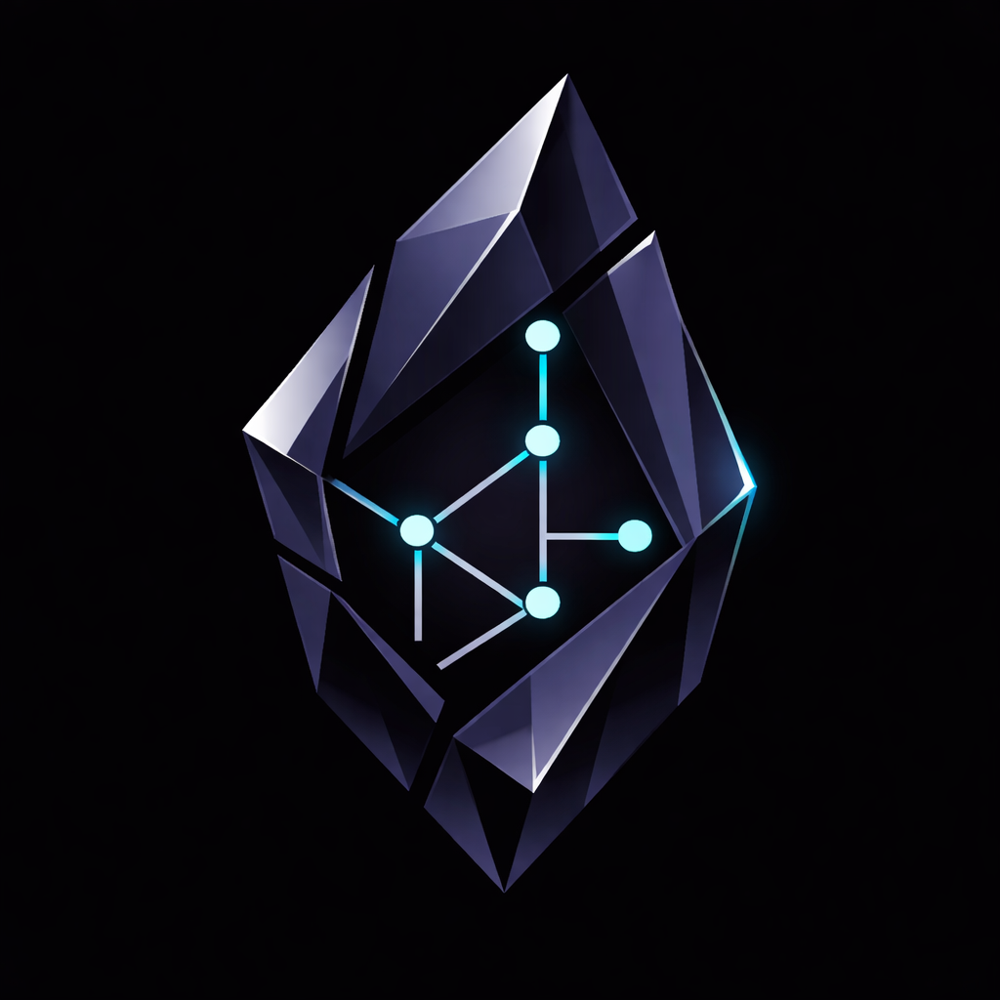

🌐 [English](README.md) | [日本語](README.ja.md) | [中文](README.zh-CN.md) | **한국어**

> [!NOTE]
> 이 번역은 AI의 도움을 받아 작성되었습니다. 부자연스러운 표현이나 오역을 발견하시면 Issue 또는 Pull Request로 알려주세요. 커뮤니티의 수정과 기여를 환영합니다.

<p align="center">
  
</p>

<h1 align="center">Obsidian Mind</h1>

[](https://docs.anthropic.com/en/docs/claude-code)
[](https://github.com/openai/codex)
[](https://github.com/google-gemini/gemini-cli)
[](https://obsidian.md)
[](https://github.com/kepano/obsidian-cli)
[](https://github.com/kepano/obsidian-skills)
[](https://github.com/tobi/qmd)
[](https://nodejs.org)
[](LICENSE)

> **Claude Code가 모든 것을 기억하게 해주는 Obsidian 볼트.** 세션을 시작하고 하루에 대해 이야기하면, Claude가 나머지를 처리합니다 — 노트, 링크, 인덱스, 성과 추적까지. 모든 대화가 이전 대화 위에 쌓입니다.

---

## 🔴 문제

Claude Code는 강력하지만 기억하지 못합니다. 매 세션이 제로에서 시작됩니다 — 당신의 목표, 팀, 패턴, 성과에 대한 컨텍스트가 없습니다. 같은 내용을 반복해서 설명해야 합니다. 세 번의 대화 전에 내린 결정이 사라집니다. 지식이 축적되지 않습니다.

## 🟢 해결책

에이전트에게 뇌를 주세요.

```
You: "start session"
에이전트: *reads North Star, checks active projects, scans recent memories*
에이전트: "You're working on Project Alpha, blocked on the BE contract.
         Last session you decided to split the coordinator. Your 1:1
         with your manager is tomorrow — review brief is ready."
```

---

## ⚡ 실제 동작 예시

<p align="center">
  
</p>

**아침 킥오프:**

```bash
/om-standup
# → loads North Star, active projects, open tasks, recent git changes
# → "You have 2 active projects. The auth refactor is blocked on API contract.
#    Your 1:1 with Sarah is at 2pm — last time she flagged observability."
```

**회의 후 브레인 덤프:**

```bash
/om-dump Just had a 1:1 with Sarah. She's happy with the auth work but wants
us to add error monitoring before release. Also, Tom mentioned the cache
migration is deferred to Q2 — we decided to focus on the API contract first.
Decision: defer Redis migration. Win: Sarah praised the auth architecture.
```

```
→ Updated org/people/Sarah Chen.md with meeting context
→ Created work/1-1/Sarah 2026-03-26.md with key takeaways
→ Created Decision Record: "Defer Redis migration to Q2"
→ Added to perf/Brag Doc.md: "Auth architecture praised by manager"
→ Updated work/active/Auth Refactor.md with error monitoring task
```

**인시던트 대응:**

```bash
/om-incident-capture https://slack.com/archives/C0INCIDENT/p123456
# → slack-archaeologist reads every message, thread, and profile
# → people-profiler creates notes for new people involved
# → Full timeline, root cause analysis, brag doc entry
```

**하루 마무리:**

```
You: "wrap up"
# → verifies all notes have links
# → updates indexes
# → brag-spotter finds uncaptured wins
# → suggests improvements
```

---

## 🚀 빠른 시작

1. 이 저장소를 클론하거나 **GitHub 템플릿**으로 사용하세요
2. 폴더를 **Obsidian 볼트**로 엽니다
3. 설정 → 일반에서 **Obsidian CLI**를 활성화합니다 (Obsidian 1.12+ 필요)
4. 볼트 디렉토리에서 에이전트를 실행합니다: **`claude`**, **`codex`**, 또는 **`gemini`**
5. **`brain/North Star.md`**에 목표를 작성합니다 — 이것이 모든 세션의 기준이 됩니다
6. 업무에 대해 이야기를 시작하세요

### 🔍 권장: QMD 시맨틱 검색

볼트 전체의 시맨틱 검색을 위해 (노트 제목이 "Redis Migration ADR"이어도 "캐싱에 대해 뭘 결정했지?"를 찾을 수 있습니다):

```bash
npm install -g @tobilu/qmd
node --experimental-strip-types scripts/qmd-bootstrap.ts
```

부트스트랩은 멱등성이 있어 재실행해도 안전합니다. `vault-manifest.json` 의 `qmd_index` 와 `qmd_context` 필드를 읽어 명명된 인덱스를 등록하고 임베딩을 생성합니다 (기본 인덱스 이름: `obsidian-mind`). SessionStart 훅, `.mcp.json` 래퍼, CLI 명령은 모두 동일한 매니페스트 필드를 참조하므로, 같은 머신의 다른 볼트와 QMD 데이터가 섞이지 않습니다. CLI 명령에는 항상 `--index <이름>` 을 전달하세요:

```bash
qmd --index obsidian-mind query "캐싱에 대해 뭘 결정했지?"
qmd --index obsidian-mind update   # 일괄 편집 후
qmd --index obsidian-mind embed    # 많은 신규 노트 후
```

**MCP를 통한 네이티브 에이전트 도구.** `.mcp.json`에 [Model Context Protocol](https://modelcontextprotocol.io) 서버로 등록되어 있습니다 — QMD가 설치되어 있으면 `mcp__qmd__query`, `mcp__qmd__get`, `mcp__qmd__multi_get`가 Read와 Edit 옆에 에이전트의 도구 메뉴에 나타납니다. 서브에이전트, 슬래시 명령, 메인 대화 모두 동일한 타입 지정 계약을 호출합니다. 나중에 다른 MCP 호환 도구(데이터베이스, 티켓팅 시스템, 캘린더)를 추가하면 같은 방식으로 플러그인됩니다.

> [!NOTE]
> QMD가 설치되어 있지 않아도 모든 기능이 작동합니다 — 에이전트가 Obsidian CLI와 grep으로 대체하고, MCP 서버 항목은 무해한 경고와 함께 건너뜁니다.

---

## 📋 요구 사항

- [Obsidian](https://obsidian.md) 1.12+ (CLI 지원)
- [Claude Code](https://docs.anthropic.com/en/docs/claude-code)
- [Node 22+ LTS](https://nodejs.org) (훅 스크립트용 — Claude Code / Codex / Gemini CLI와 함께 이미 설치되어 있을 가능성이 큽니다)
- Git (버전 히스토리용)
- [QMD](https://github.com/tobi/qmd) (선택 사항, 시맨틱 검색용)

> **Node 플래그에 관한 참고.** 훅 스크립트는 Node의 `--experimental-strip-types` 플래그로 TypeScript를 직접 실행합니다. 이 플래그는 Node 22.6+ (2024년 8월)부터 안정화되었고, Node 23.6+ 에서는 기본 동작이 되었습니다. 실험적(experimental)으로 표시되어 있지만 22 LTS와 24 LTS 전반에서 동작이 변경된 적은 없습니다. 향후 Node 릴리스에서 플래그가 폐지되거나 이름이 변경되면 `.claude/settings.json`, `.codex/hooks.json`, `.gemini/settings.json`의 훅 명령어를 한 줄만 수정하면 됩니다.

---

## ⚙️ 작동 원리

**절차적 코드는 환경을 소유하고, 에이전트는 콘텐츠를 소유합니다.** `.claude/scripts/`의 훅이 분류, 검증, 인덱싱, 라이프사이클 주입을 처리합니다 — 결정론적이고, 테스트 가능하며, 모든 에이전트에서 동일하게 실행됩니다. 노트를 작성하고, 분류하고, 링크하고, 브리프를 작성하는 것 — 이는 판단이며 에이전트의 몫으로 남겨집니다. 양쪽은 작은 핸드오프에서 만납니다(훅이 컨텍스트를 주입하고 에이전트가 볼트를 읽음) — 서로의 일을 할 필요가 없습니다.

**폴더는 용도별로 그룹화하고, 링크는 의미별로 그룹화합니다.** 노트는 하나의 폴더(본거지)에 있지만 여러 노트(컨텍스트)에 링크됩니다. 에이전트는 이 그래프를 유지 관리합니다 — 작업 노트를 사람, 의사결정, 역량에 자동으로 연결합니다. 리뷰 시즌이 오면 각 역량 노트의 백링크가 이미 증거 자료가 됩니다. 링크가 없는 노트는 버그입니다.

**볼트 우선 메모리**는 세션과 기기 간에 컨텍스트를 유지합니다. 모든 지속 지식은 `brain/` 토픽 노트에 있습니다(git 추적, Obsidian 브라우저 가능, 링크됨). Claude Code의 `MEMORY.md`(`~/.claude/`)는 볼트 위치를 가리키는 자동 로드 인덱스일 뿐 — 저장소 자체가 아닙니다. 즉, 메모리가 기기 변경에도 유지되며 그래프의 일부가 됩니다.

**세션은 설계된 생명주기를 따릅니다.** `SessionStart` 훅이 North Star 목표, 활성 프로젝트, 최근 변경사항, 미완료 작업, 전체 볼트 파일 목록을 자동 주입합니다 — Claude는 빈 상태가 아니라 컨텍스트가 있는 상태로 모든 세션을 시작합니다. 마무리할 때 "wrap up"이라고 말하면 Claude가 `/om-wrap-up`을 실행합니다 — 노트 검증, 인덱스 업데이트, 누락된 성과 발견. 285줄의 `CLAUDE.md`가 그 사이의 모든 것을 관리합니다: 파일 배치 위치, 링크 방법, 노트를 분할해야 할 때, 의사결정과 인시던트 처리 방법.

### 🔗 훅

다섯 개의 생명주기 훅이 라우팅을 자동으로 처리합니다:

| 훅 | 시점 | 동작 |
|------|------|------|
| 🚀 SessionStart | 시작/재개 시 | QMD 재인덱싱, North Star·활성 작업·최근 변경사항·작업·파일 목록 주입 |
| 💬 UserPromptSubmit | 매 메시지마다 | 콘텐츠 분류(의사결정, 인시던트, 성과, 1:1, 아키텍처, 인물, 프로젝트 업데이트) 및 라우팅 힌트 주입 |
| ✍️ PostToolUse | `.md` 작성 후 | 프론트매터 유효성 검사, 위키링크 확인 |
| 💾 PreCompact | 컨텍스트 압축 전 | 세션 트랜스크립트를 `thinking/session-logs/`에 백업 |
| 🏁 Stop | 세션 종료 시 | 체크리스트: 완료된 프로젝트 아카이브, 인덱스 업데이트, 고아 노트 확인 |

> [!TIP]
> 그냥 이야기하세요. 훅이 라우팅을 처리합니다.

### ⚡ 토큰 효율성

obsidian-mind는 전체 볼트를 컨텍스트에 로드하지 **않습니다**. 계층형 로딩으로 토큰 비용을 최소화합니다:

| 계층 | 내용 | 시점 | 비용 |
|------|------|------|------|
| **항상** | `CLAUDE.md` + SessionStart 컨텍스트 (North Star 발췌, git 요약, 작업, 볼트 파일 목록) | 세션 시작 시 | ~2K 토큰 |
| **온디맨드** | QMD 시맨틱 검색 결과 | 에이전트가 특정 컨텍스트 필요 시 | 대상만 |
| **트리거** | 분류 라우팅 힌트 | 매 메시지 | ~100 토큰 |
| **트리거** | PostToolUse 검증 | `.md` 작성 후 | ~200 토큰 |
| **드물게** | 전체 파일 읽기 | 명시적으로 필요한 경우만 | 가변 |

SessionStart는 **가벼운 컨텍스트**를 로드합니다 — 주요 파일의 짧은 발췌, 파일명, git 요약만 로드하며 전체 노트 내용은 읽지 않습니다. 에이전트는 QMD를 통해 의미 기반 검색 후 파일을 읽으므로 관련 정보만 가져옵니다. 분류 훅은 메시지당 가벼운 Node 호출 1회입니다. 검증 훅은 마크다운 쓰기 시에만 실행되며 제외된 경로는 건너뜁니다.

### 🌐 다른 에이전트와 사용하기

obsidian-mind는 Claude Code, Codex CLI, Gemini CLI에서 작동합니다. `CLAUDE.md`의 볼트 규약, `.claude/scripts/`의 훅 스크립트, `.claude/commands/`의 18개 커맨드는 모두 에이전트 비의존적입니다 — 순수 Markdown, TypeScript, 셸이며 SDK 의존성이 없습니다.

**Claude Code** — 완전 지원. 훅, 커맨드, 서브에이전트, 메모리 시스템이 모두 기본으로 작동합니다.

**Codex CLI** — `AGENTS.md`를 네이티브로 읽습니다. `.codex/hooks.json`의 훅 설정이 Claude Code와 동일한 훅 스크립트를 연결합니다 — 세션 컨텍스트, 메시지 분류, 쓰기 검증이 자동으로 작동합니다.

**Gemini CLI** — `GEMINI.md`를 네이티브로 읽습니다. `.gemini/settings.json`의 훅 설정이 Gemini의 이벤트 이름을 공유 훅 스크립트에 매핑합니다.

**기타 에이전트** (Cursor, Windsurf, GitHub Copilot, JetBrains AI) — `AGENTS.md`로 볼트 규약을 읽습니다. 훅 지원은 에이전트마다 다릅니다.

> [!NOTE]
> 훅, 커맨드, 서브에이전트 프롬프트, 볼트 메모리(`brain/`)는 모두 에이전트 비의존적입니다. `~/.claude/` 자동 메모리 로더만 Claude Code 전용입니다. 자세한 내용은 `AGENTS.md`를 참조하세요.

---

## 📅 일일 워크플로우

**아침**: `/om-standup`을 실행합니다. 에이전트가 North Star, 활성 프로젝트, 미완료 작업, 최근 변경사항을 로드합니다. 구조화된 요약과 추천 우선순위를 받습니다.

**하루 중**: 자연스럽게 이야기하세요. 내린 결정, 발생한 인시던트, 방금 마친 1:1, 기억하고 싶은 성과를 언급하세요. 분류 훅이 에이전트가 각 항목을 올바르게 기록하도록 안내합니다. 더 큰 브레인 덤프를 하려면 `/om-dump`을 사용하고 한 번에 모든 것을 이야기하세요.

**하루 끝**: "wrap up"이라고 말하면 에이전트가 `/om-wrap-up`을 호출합니다 — 노트 검증, 인덱스 업데이트, 링크 확인, 누락된 성과 발견.

**주간**: `/om-weekly`를 실행하여 세션 간 종합 분석 — North Star 정렬, 패턴, 누락된 성과, 다음 주 우선순위. `/om-vault-audit`를 실행하여 고아 노트, 깨진 링크, 오래된 콘텐츠를 점검합니다.

**리뷰 시즌**: `/om-review-brief manager`를 실행하면 모든 증거가 이미 링크된 구조화된 리뷰 준비 문서를 받습니다.

---

## 🛠️ 명령어

`.claude/commands/`에 정의되어 있습니다. 모든 Claude Code 세션에서 실행할 수 있습니다.

| 명령어 | 기능 |
|---------|-------------|
| `/om-standup` | 아침 킥오프 — 컨텍스트 로드, 어제 리뷰, 작업 표면화, 우선순위 제안 |
| `/om-dump` | 자유 형식 캡처 — 무엇이든 자연스럽게 이야기하면 올바른 노트로 라우팅 |
| `/om-wrap-up` | 전체 세션 리뷰 — 노트, 인덱스, 링크 검증, 개선사항 제안 |
| `/om-humanize` | 목소리 보정 편집 — Claude가 작성한 텍스트를 본인이 쓴 것처럼 수정 |
| `/om-weekly` | 주간 종합 — 세션 간 패턴, North Star 정렬, 누락된 성과 |
| `/om-prep-1on1` | 1:1 준비 — 상대방 컨텍스트, 미해결 항목, 제안 안건 로드 |
| `/om-meeting` | 주제별 미팅 준비 — 미해결 항목, 차단 요소, 고려사항 브리핑 |
| `/om-intake` | 미팅 노트 수신함 처리 — `work/meetings/`의 파일을 분류하고 적절한 노트로 라우팅 |
| `/om-capture-1on1` | 1:1 미팅 트랜스크립트를 구조화된 볼트 노트로 캡처 |
| `/om-incident-capture` | Slack/채널의 인시던트를 구조화된 노트로 캡처 |
| `/om-slack-scan` | Slack 채널/DM을 깊이 스캔하여 증거 수집 |
| `/om-peer-scan` | 동료의 GitHub PR을 깊이 스캔하여 리뷰 준비 |
| `/om-review-brief` | 리뷰 브리프 생성 (매니저 또는 동료 버전) |
| `/om-self-review` | 리뷰 시즌을 위한 자기 평가 작성 — 프로젝트, 역량, 원칙 |
| `/om-review-peer` | 동료 리뷰 작성 — 프로젝트, 원칙, 성과 요약 |
| `/om-vault-audit` | 인덱스, 링크, 고아 노트, 오래된 컨텍스트 감사 |
| `/om-vault-upgrade` | 기존 볼트에서 콘텐츠 가져오기 — 버전 감지, 분류, 마이그레이션 |
| `/om-project-archive` | 완료된 프로젝트를 active/에서 archive/로 이동, 인덱스 업데이트 |

---

## 🤖 서브에이전트

격리된 컨텍스트 윈도우에서 실행되는 전문 에이전트입니다. 메인 대화를 오염시키지 않고 무거운 작업을 처리합니다.

| 에이전트 | 용도 | 호출 방법 |
|-------|---------|------------|
| `brag-spotter` | 누락된 성과와 역량 격차 발견 | `/om-wrap-up`, `/om-weekly` |
| `context-loader` | 인물, 프로젝트, 개념에 대한 모든 볼트 컨텍스트 로드 | 직접 호출 |
| `cross-linker` | 누락된 위키링크, 고아 노트, 깨진 백링크 발견 | `/om-vault-audit` |
| `people-profiler` | Slack 프로필에서 인물 노트를 일괄 생성/업데이트 | `/om-incident-capture` |
| `review-prep` | 리뷰 기간의 모든 성과 증거 집계 | `/om-review-brief` |
| `slack-archaeologist` | 전체 Slack 복원 — 모든 메시지, 스레드, 프로필 | `/om-incident-capture` |
| `vault-librarian` | 심층 볼트 유지보수 — 고아 노트, 깨진 링크, 오래된 노트 | `/om-vault-audit` |
| `review-fact-checker` | 리뷰 초안의 모든 주장을 볼트 소스와 대조 검증 | `/om-self-review`, `/om-review-peer` |
| `vault-migrator` | 소스 볼트에서 콘텐츠 분류, 변환, 마이그레이션 | `/om-vault-upgrade` |

> [!NOTE]
> 서브에이전트는 `.claude/agents/`에 정의되어 있습니다. 도메인별 워크플로우를 위해 직접 추가할 수 있습니다.

---

## 📊 성과 그래프

볼트는 성과 추적 시스템으로도 활용됩니다:

1. **역량 노트**(`perf/competencies/`)가 조직의 역량 프레임워크를 정의합니다 — 역량별로 하나의 노트
2. **작업 노트**가 `## Related` 섹션에서 역량에 링크하며, 어떤 역량이 발휘되었는지 주석을 답니다
3. **백링크가 자동으로 축적됩니다** — 리뷰 준비는 각 역량 노트의 백링크 패널을 읽는 것으로 충분합니다
4. **Brag Doc**가 분기별 성과를 증거 노트 링크와 함께 집계합니다
5. **`/om-peer-scan`**이 동료의 GitHub PR을 깊이 스캔하고 구조화된 증거를 `perf/evidence/`에 작성합니다
6. **`/om-review-brief`**가 모든 것을 집계하여 전체 리뷰 브리프를 생성합니다: Brag 항목, 의사결정, 인시던트, 역량 증거, 1:1 피드백

> [!TIP]
> 시작하려면: 템플릿에서 역량 노트를 만들고, 작업하면서 작업 노트에 역량을 링크하세요. 그래프가 나머지를 처리합니다.

---

## 📋 Bases

`bases/` 폴더에는 노트의 프론트매터 속성을 쿼리하는 데이터베이스 뷰가 있습니다. 노트가 변경되면 자동으로 업데이트됩니다.

| Base | 표시 내용 |
|------|-------|
| Work Dashboard | 분기별 필터링, 상태별 그룹화된 활성 프로젝트 |
| Incidents | 심각도와 날짜순으로 정렬된 모든 인시던트 |
| People Directory | `org/people/`의 모든 인물과 역할, 팀 정보 |
| 1:1 History | 인물과 날짜로 정렬 가능한 모든 1:1 노트 |
| Review Evidence | 인물과 주기별로 그룹화된 PR 스캔 및 증거 |
| Competency Map | 백링크 기반 증거 수를 포함한 역량 목록 |
| Templates | 모든 템플릿에 대한 빠른 접근 |

`Home.md`가 이 뷰들을 임베드하여 볼트의 대시보드 역할을 합니다.

---

## 📁 볼트 구조

```
Home.md                 볼트 진입점 — 임베드된 Base 뷰, 바로가기 링크
CLAUDE.md               운영 매뉴얼 — 에이전트가 매 세션마다 읽음
AGENTS.md               멀티에이전트 가이드 — Codex, Cursor, Windsurf 등
GEMINI.md               멀티에이전트 가이드 — Gemini CLI
vault-manifest.json     템플릿 메타데이터 — 버전, 구조, 스키마
CHANGELOG.md            버전 히스토리
CONTRIBUTING.md         템플릿 개발 체크리스트
README.md               제품 문서
LICENSE                 MIT 라이선스

bases/                  동적 데이터베이스 뷰 (Work Dashboard, Incidents, People 등)

work/
  active/               현재 프로젝트 (한 번에 1–3개 파일)
  archive/YYYY/         완료된 작업, 연도별 정리
  incidents/            인시던트 문서 (메인 노트 + RCA + 심층 분석)
  1-1/                  1:1 미팅 노트 — <Person> YYYY-MM-DD.md 형식
  Index.md              모든 작업의 Map of Content

org/
  people/               인물별 노트 — 역할, 팀, 관계, 주요 순간
  teams/                팀별 노트 — 구성원, 범위, 상호작용
  People & Context.md   조직 지식의 MOC

perf/
  Brag Doc.md           증거에 링크된 성과 기록
  brag/                 분기별 Brag 노트 (분기당 하나)
  competencies/         역량별 노트 (링크 대상)
  evidence/             PR 심층 스캔, 리뷰용 데이터 추출
  <cycle>/              리뷰 주기별 브리프 및 산출물

brain/
  North Star.md         목표와 집중 영역 — 매 세션마다 읽음
  Memories.md           메모리 토픽 인덱스
  Key Decisions.md      중요한 의사결정과 근거
  Patterns.md           작업 전반에서 관찰된 반복 패턴
  Gotchas.md            잘못된 것들과 그 이유
  Skills.md             커스텀 워크플로우와 슬래시 명령어

reference/              코드베이스 지식, 아키텍처 맵, 플로우 문서
thinking/               초안을 위한 스크래치패드 — 결과 정리 후 삭제
templates/              YAML 프론트매터가 포함된 Obsidian 템플릿

.claude/
  commands/             18개 슬래시 명령어
  agents/               9개 서브에이전트
  scripts/              훅 스크립트 + charcount.ts 유틸리티
  skills/               Obsidian + QMD 스킬
  settings.json         5개 훅 설정
```

---

## 📝 템플릿

YAML 프론트매터가 포함된 템플릿으로, 각각 점진적 공개를 위한 `description` 필드를 포함합니다:

- **Work Note** — 날짜, 설명, 프로젝트, 상태, 분기, 태그
- **Decision Record** — 날짜, 설명, 상태 (proposed/accepted/deprecated), 담당자, 맥락
- **Thinking Note** — 날짜, 설명, 맥락, 태그 (스크래치패드 — 정리 후 삭제)
- **Competency Note** — 날짜, 설명, 현재 레벨, 목표 레벨, 숙련도 표
- **1:1 Note** — 날짜, 상대방, 핵심 요점, 액션 아이템, 인용, 주시 사항
- **Incident Note** — 날짜, 티켓, 심각도, 역할, 타임라인, 근본 원인, 영향

---

## 🔧 포함 항목

### 🧩 Obsidian 스킬

[kepano/obsidian-skills](https://github.com/kepano/obsidian-skills)가 `.claude/skills/`에 사전 설치되어 있습니다:

- **obsidian-markdown** — Obsidian 특화 마크다운 (위키링크, 임베드, 콜아웃, 속성)
- **obsidian-cli** — 볼트 운영을 위한 CLI 명령어
- **obsidian-bases** — 데이터베이스 스타일 `.base` 파일
- **json-canvas** — 시각적 `.canvas` 파일 생성
- **defuddle** — 웹 페이지를 마크다운으로 추출

### 🔍 QMD 스킬

`.claude/skills/qmd/`에 있는 커스텀 스킬로, Claude가 [QMD](https://github.com/tobi/qmd) 시맨틱 검색을 능동적으로 사용하도록 합니다 — 파일을 읽기 전, 노트 생성 전(중복 확인), 노트 생성 후(링크할 관련 콘텐츠 탐색).

---

## 🎨 커스터마이즈

이것은 출발점입니다. 자신의 업무 방식에 맞게 조정하세요:

| 항목 | 위치 |
|------|-------|
| 목표 | `brain/North Star.md` — 모든 세션의 기준 |
| 조직 | `org/` — 매니저, 팀, 핵심 협력자 추가 |
| 역량 | `perf/competencies/` — 조직의 프레임워크에 맞추기 |
| 도구 | `.claude/commands/` — GitHub 조직, Slack 워크스페이스에 맞게 편집 |
| 규칙 | `CLAUDE.md` — 운영 매뉴얼, 진행하면서 발전시키기 |
| 도메인 | 폴더 추가, `.claude/agents/`에 서브에이전트 추가, `.claude/scripts/`에 분류 규칙 추가 |

> [!IMPORTANT]
> `CLAUDE.md`는 운영 매뉴얼입니다. 규칙을 변경하면 이 파일을 업데이트하세요 — 에이전트가 매 세션마다 읽습니다.

---

## 🔄 업그레이드

### 에이전트에게 요청하기

가장 간단한 방법 — 에이전트에게 말하세요:

```
이 볼트를 최신 obsidian-mind로 업데이트해줘 https://github.com/breferrari/obsidian-mind
```

에이전트가 최신 변경사항을 가져오고, 충돌을 해결하고, 인프라 파일을 업데이트합니다. Claude Code, Codex CLI, Gemini CLI 모두에서 작동합니다.

### 기존 클론 업데이트

리포지토리를 직접 클론한 경우:

```bash
cd your-vault
git pull origin main
```

새 파일(`AGENTS.md`, `GEMINI.md`, `.codex/`, `.gemini/`)이 자동으로 추가되고 훅 스크립트도 업데이트됩니다.

### 포크 업데이트

리포지토리를 포크한 경우:

```bash
git remote add upstream https://github.com/breferrari/obsidian-mind.git
git fetch upstream
git merge upstream/main
```

커스터마이징한 파일(일반적으로 `CLAUDE.md`, `brain/` 노트)의 충돌을 해결하세요. 인프라 파일(`.claude/scripts/`, `.codex/`, `.gemini/`)은 깔끔하게 병합됩니다.

### 이전 볼트에서 마이그레이션

이전 버전의 obsidian-mind(또는 기존 Obsidian 볼트)를 사용 중이신가요? `/om-vault-upgrade` 명령어가 최신 템플릿으로 콘텐츠를 마이그레이션합니다:

```bash
# 1. 최신 obsidian-mind 클론
git clone https://github.com/breferrari/obsidian-mind.git ~/new-vault

# 2. 에이전트로 열기
cd ~/new-vault && claude   # 또는 codex, gemini

# 3. 이전 볼트를 지정하여 업그레이드 실행
/om-vault-upgrade ~/my-old-vault
```

에이전트가 수행하는 작업:
1. **감지** — 볼트 버전 확인 (v1–v3.x, 또는 obsidian-mind가 아닌 볼트 식별)
2. **인벤토리** — 모든 파일을 사용자 콘텐츠, 스캐폴드, 인프라, 미분류로 분류
3. **마이그레이션 계획 제시** — 복사, 변환, 건너뛸 항목을 정확히 보여줌
4. **승인 후 실행** — 프론트매터 변환, 위키링크 수정, 인덱스 재구축
5. **검증** — 고아 노트, 깨진 링크, 누락된 프론트매터 확인

기존 볼트는 **절대 수정되지 않습니다**. `--dry-run`을 사용하면 실행 없이 계획만 미리 볼 수 있습니다.

> [!NOTE]
> obsidian-mind뿐만 아니라 모든 Obsidian 볼트에서 작동합니다. obsidian-mind가 아닌 볼트의 경우, 에이전트가 각 노트를 읽고 의미적으로 분류합니다 — 작업 노트, 인물, 인시던트, 1:1, 의사결정을 올바른 폴더로 라우팅합니다.

---

## 🗺️ 로드맵

**기여는 환영합니다.** 파일 하나를 초과하는 변경 사항은 먼저 이슈를 열어 주세요. 특히 훅, 설치, 또는 설치에 필요한 요구 사항에 관련된 변경은 필수입니다. 머지할 수 없는 것을 만드는 수고를 덜 수 있습니다.

---

## 🙏 디자인 영향

- [kepano/obsidian-skills](https://github.com/kepano/obsidian-skills) — 공식 Obsidian 에이전트 스킬
- [James Bedford](https://x.com/jameesy) — 볼트 구조 철학, AI 생성 콘텐츠 분리
- [arscontexta](https://github.com/agenticnotetaking/arscontexta) — description 필드를 통한 점진적 공개, 세션 훅

---

## 👤 저자

**[Brenno Ferrari](https://brennoferrari.com)** 제작 — 베를린의 시니어 iOS 엔지니어, Claude Code로 개발자 도구를 구축하고 있습니다.

---

## 📄 라이선스

MIT
